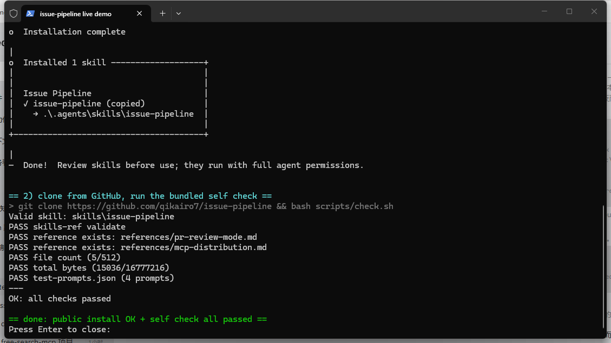

<sub>🌐 <b>中文</b> · <a href="README.en.md">English</a></sub>

<div align="center">

# issue-pipeline

> *「issue 列表不会自己变短——但可以变成一条流水线。」*

[](skills/issue-pipeline/SKILL.md)
[](https://skills.sh/qikairo7/issue-pipeline)
[](LICENSE)

**把一个仓库的 GitHub issues / PR 从拉取、分诊、实现、审查推进到回写关闭的五阶段流水线——同类只做单段，这条从头铺到尾，还带一份评审反馈落实模式。**

[看效果](#效果示例) · [安装](#快速开始) · [触发方式](#触发方式) · [它和同类有什么不同](#它和同类有什么不同) · [安全边界](#安全边界)

</div>

---



<sub>真实运行回放：公网 `npx skills add` 安装 → `git clone` → `bash scripts/check.sh`，6 项自检全过。非演示数据。</sub>

---

## 它解决什么问题

事情是这样的：你接手一个开源仓库，open issues 三十几条，PR 里躺着维护者的评审意见，三天后 CI 悄悄转红。每次处理都得重新想一遍——先看什么？复现不了算谁的？评审意见要不要全听？回帖怎么写不像机器人？

普通做法是每次现场发挥：能修，但质量看心情，纪律不积累。同类 skill 解决了其中一段——分诊的、审查的、自动修的——段与段之间还是靠你人肉缝。

这个 skill 把整条河铺完：**拉取同步 → 分诊验证 → 认领实现 → 双轴审查 → 回写 GitHub**，五段各带完成标准；另有一份同行没有的 **PR 评审反馈落实模式**——维护者意见即规格，逐条落实、双轴核验、以你的账号身份回帖。

## 效果示例

真实战例（应作者要求对仓库脱敏，数字来自运行日志）：[落实一份 PR 评审意见 · 全流程回放](skills/issue-pipeline/examples/review-feedback-run.md)

```text
输入   用 issue-pipeline 处理 <带评审意见的 PR>
动作   判身份（PR 作者）→ 基线复跑 17 测试全绿 → 按两条意见修改
       （删 5 旧测试补 2 新钉子）→ 双轴审查抓出 1 个报错文案缺陷并修复
输出   全量 1893 tests 绿 · typecheck 过 · 推送后 9 项 CI 全绿
       → PR 标题正文同步收窄 → 作者身份逐条回帖附证据
```

## 快速开始

前置：`gh` 已登录（本 skill 零 API key，读写全走 gh / GitHub MCP）。

```bash
npx skills add qikairo7/issue-pipeline
```

gh CLI 用户也可以：

```bash
gh skill install qikairo7/issue-pipeline
```

装完对 Agent 说：

```text
用 issue-pipeline 处理 https://github.com/<owner>/<repo>/pull/<编号>
```

## 触发方式

- 「用 issue-pipeline 处理这个 PR」
- 「帮我消化 <repo> 的 open issues」
- 「落实这条 PR 上的评审意见」
- 「认领并修复 issue #123」
- 「把这个仓库的 issues 拉到本地，改完推回去」
- 「分诊一下这个仓库的 bug 报告」

不触发：只读问答（查版本、看某条 issue 内容）——那不需要流水线。

## 它和同类有什么不同

| 维度 | 同类做法 | issue-pipeline |
|---|---|---|
| 覆盖范围 | 单段：分诊（[github-triage](https://www.skills.sh/trailofbits/skills/github-triage)、[triage](https://www.skills.sh/mattpocock/skills/triage)）或审查（Tessl pr 类）或自动修复（[github-issue-resolver](https://clawhub.ai/ashwinhegde19/skills/github-issue-resolver)） | 拉取→分诊→实现→审查→回写全流程，段间有完成标准 |
| 评审反馈 | 无此段 | **意见即规格**：逐条落实、没点名不动、修订单 commit、正文随范围收窄同步更新 |
| 回帖口吻 | 未编码 | 以当前账号身份第一人称写，证据给数字，缺陷来源写清 |
| 审查 | 单视角或无 | 双轴：Spec（issue 或评审意见）+ Standards（目标仓库自己的规范文档） |
| 失败模式 | 各有覆盖 | CI 转红跟进、外发被拒即停、复现不了停 needs-info、缺依赖降级不停摆 |

## 安全边界

- 外发写操作（评论、关闭、push）以你当次会话的授权为准；被拒立即停手报告，不绕路重试。
- 不 force-push——回退用 revert，保持历史可审计。
- 不代维护者合并、打 tag、发版；有权限也先请示。
- bug 复现不了停在 `needs-info` 回帖提问，不带猜测进实现。
- 无 gh 登录先报告，不降级成网页抓取。

## 文件结构

```text
├── README.md                        ← 本文件
├── LICENSE                          ← MIT
├── .claude-plugin/marketplace.json  ← Claude Code plugin marketplace 双通道
├── scripts/check.sh                 ← clone 后一条命令自检（规范+引用+限额）
└── skills/issue-pipeline/
    ├── SKILL.md                     ← 五阶段流水线正文（含 PR 模式路由）
    ├── references/
    │   ├── pr-review-mode.md        ← PR 评审反馈模式的五阶段映射
    │   └── mcp-distribution.md      ← MCP 分发（ext-skills）就绪核对
    ├── examples/
    │   └── review-feedback-run.md   ← 脱敏真实战例（PR 评审落实全流程）
    └── test-prompts.json            ← 4 条验收 prompt 与 kill 条件
```

## 验证与测试

```bash
bash scripts/check.sh
```

覆盖：skills-ref 规范校验（可用时）、SKILL.md 引用文件存在性、ext-skills 分发限额、test-prompts 合法性。验收 prompt 见 [test-prompts.json](skills/issue-pipeline/test-prompts.json)——每条带 killCondition，跑一条就知道装没装对。

## 致谢

- 技能格式与渐进披露模型：[Agent Skills 规范](https://agentskills.io/specification)
- MCP 分发核对方法：[modelcontextprotocol/ext-skills](https://github.com/modelcontextprotocol/ext-skills)
- 仓库结构参考：[anthropics/skills](https://github.com/anthropics/skills)

## License

[MIT](LICENSE)
